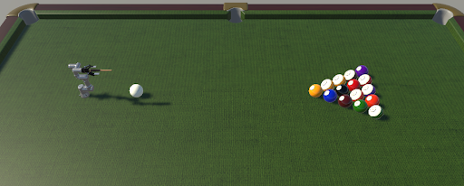

# Billiards Robot Specialist

[](https://opensource.org/licenses/Apache-2.0)

This is a project using a UR3 robotic arm for billiards in Unity.

> Note: This project has been developed with Python 3 and ROS Noetic.

**Table of Contents**
- [Part 1: Project Introduction](#link-part-1)
- [Part 2: Demo](#link-part-2)
- [Part 3: Architecture](#link-part-3)
- [Part 4: Project Detail](#link-part-4)
- [Part 5: Team Introduction](#link-part-5)

---
### <a name="link-part-1">[Part 1: Project Introduction]</a>



The course is *Intelligent Robotics Systems* of the academic year of 2021-2022, at Institute of System Science,  National University of Singapore. This project aims to build an intelligent robot based on improving the health and well-being of the society. We are here to develop a competitive automated robot to play the billiard game with human players.

In the game, the cue ball is hit by the end of the club, causing it to bounce off another ball and drop into a pocket of the table. A good player needs to have precise geometry and strategy to win the game. This project presents our developed billiard robot. This 6-DoF robot is fixed on the pool table and can change the position and orientation of the club and finally give a hit to the cue ball based on the perception and decision.


---
### <a name="link-part-2">[Part 2: Demo]</a>
#### Examples of the demo of the three cases 
The execution of the objective is shown  in the demo video, in which we have included three scenarios: **Direct hit**, **indirect hit**, and **big-angle indirect hit**.


**Direct hit:**  to test the accuracy and precision of a hit and the subsequent trajectory


**Indirect hit:**  to test the accuracy and precision of of the target ball after the collision simulated, obeying the game rules


**Big-angle indirect hit:**  a more intelligent actuation based on decision and planning

#### Video
[![Watch the video] ](https://youtu.be/RIpQyh7deWE)
---
### <a name="link-part-3">[Part 3: Architecture]</a>

There are 4 main modules in this system architecture, namely perception, reflection, 
knowledge repository, and decision-making module. Below figure illustrates the general 
architecture.


The system is based on ROS, in which there are the robot simulation module based on *Unity3D* and  the computing module of [Perception](#link-改) and [Decision](#link-改). 

The perception module extracts information from the bird-eye-view camera's image data set above the billiard table. The reflection module (*Unity3D*) then builds the environment model of the billiard table with the information. After that, the decision module will accomplish physical simulation, trajectory calculation, and arm planning with the help of the environment model and knowledge repository. Finally, the commands will be sent to the actuator in the robot arm.


---
### <a name="link-part-4">[Part 4: Project Detail]</a>

#### ROS Setup
This project uses a Docker container as the ROS workspace. 

Building this Docker container will install the necessary packages for this project.
```bash
cd RobotSimulation
docker build -t BilliardRobot:unity-simulation -f docker/Dockerfile .
```

>Note: The provided Dockerfile uses the [ROS Neotic base Image](https://hub.docker.com/_/ros/). Building the image will install the necessary packages as well as copy the provided ROS packages and PlanningCore folder to the container, and build the catkin workspace.

To start the newly built Docker container, run this command:
```bash
docker run -it --rm -p 10000:10000 -p 5005:5005 BilliardRobot:unity-simulation /bin/bash
```

Run the following roslaunch command in order to start roscore, set the ROS parameters, start the server endpoint, start the Services and nodes, and launch MoveIt.

In the terminal window of the ROS workspace, run the provided launch file:

```bash
roslaunch ur3_moveit pose_est.launch
```

#### Unity Scene
* [FinalRobot_data.unity](RobotSimulation/RobotBilliardProject/Assets/Scenes/FinalRobot_data.unity): This scene is used to generate birds-eye-view image data.
* [FinalRobot_demo.unity](RobotSimulation/RobotBilliardProject/Assets/Scenes/FinalRobot_demo.unity): This is the demo scene. After the ROS has started, press the "Play" button to start the Unity demo. There are four buttons on the left bottom, namely "direct shot," "indirect shot," "Pos," and "Shoot," respectively. The effects of "direct shot" and "indirect shot" are shown in the demo video.

#### Planning Core
The planning module is to find the optimal strike angle that can make the target ball sink. 
This module can be separated into physical simulation and shot angle search. 

The planning module takes the balls' location information from the perception module and 
initializes the balls based on the location information.

After which, the shot angle search part will find the strike angle depending on the result
of the physical simulation after the cue strike.


* [billiard](./RobotSimulation/PlanningCore/billiard) `<- Hold the basic elements in billiard world`
* [core](./RobotSimulation/PlanningCore/core) `<- The core functions of Planning module`
  * [constants](./RobotSimulation/PlanningCore/core/constants.py) `<- The physics constants`
  * [physics](./RobotSimulation/PlanningCore/core/physics.py) `<- Implement the physical formulas`
  * [planning](./RobotSimulation/PlanningCore/core/planning.py) `<- Planning algorithms for shot angle search`
  * [simulation](./RobotSimulation/PlanningCore/core/simulation.py) `<- Physical simulation algorithms`
  * [utils](./RobotSimulation/PlanningCore/core/utils.py) `<- Util funtions shared by the above functions`
* [robot](./RobotSimulation/PlanningCore/robot) `<- Hold the basic elements of robot`


---
### <a name="link-part-5">[Part 5: Team Introduction]</a>
This is a team of students from the ISS of the National University of Singapore. 
We learned the course of the robot system in the classroom, and built this billiard 
robot system by applying the knowledge we learned. If you have any questions, please 
feel free to contact us.


## License
[Apache License 2.0](LICENSE)
